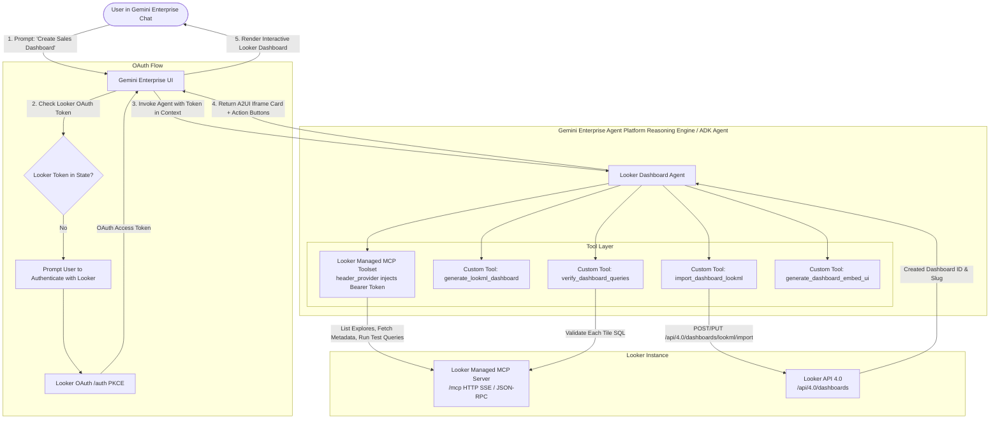

# Looker LookML Dashboard Architect Agent for Gemini Enterprise 🚀

An autonomous AI agent built with **Google ADK (Agent Development Kit)** designed to run in **Gemini Enterprise**. The agent discovers semantic models, synthesizes production LookML dashboards, executes pre-import live query verification via the **Looker MCP Server**, imports live dashboards in-place into Looker via API, and presents interactive embedded dashboard views directly in Gemini Enterprise chat via **A2UI**.

---

## 🏛️ System Architecture



---

## 📋 Prerequisites

1. **Python 3.11+** installed.
2. **Google Cloud SDK (`gcloud`)** authenticated:
   ```bash
   gcloud auth login
   gcloud auth application-default login
   ```
3. **Google Agents CLI (`agents-cli`)** installed:
   ```bash
   # Recommended via uv
   uv tool install google-agents-cli

   # Or via pip
   pip install google-agents-cli
   ```
4. **Gemini Enterprise** environment in your target GCP project.
5. **Looker Instance (API 4.0 + Looker Managed MCP enabled)** at `https://<your-instance>.cloud.looker.com`. Alternatively, a self deployment of MCP toolbox with Looker oauth source enabled is viable.
6. **Looker Embed Domain Allowlist**:
   - Ensure your Gemini Enterprise domain (e.g. `https://vertexaisearch.cloud.google.com` or your custom domain) is added under Looker Admin -> Platform -> Embed -> **Embedded Domain Allowlist**.

---

## ⚡ Setup & Deployment Order

### 1. Configure Environment

Copy `.env.example` to `.env` and fill in your details:

```bash
cp .env.example .env
```

Key environment variables:

```bash
GOOGLE_CLOUD_PROJECT=your-gcp-project-id
GOOGLE_CLOUD_LOCATION=us-east4
LOOKERSDK_BASE_URL=https://your-instance.cloud.looker.com
AUTH_ID=looker-oauth
```

### 2. Create Looker OAuth Client

Register the OAuth application in your Looker instance for Gemini Enterprise:

```bash
make register-oauth-client
```

Copy the generated `LOOKER_OAUTH_CLIENT_ID` into `.env`.

### 3. Provision Discovery Engine OAuth Authorization

Configure server-side PKCE OAuth for Looker in Google Cloud Discovery Engine:

```bash
make setup-oauth
```

### 4. Deploy to Vertex AI Agent Runtime

Deploy the containerized agent to Vertex AI Agent Runtime using `agents-cli`:

```bash
# Synchronous deploy
make deploy

# Or non-blocking deploy with background status polling
make deploy-no-wait
make deploy-status
```

Copy the generated `REASONING_ENGINE_ID` into `.env`.

### 5. Register with Gemini Enterprise

Associate the deployed Reasoning Engine with Gemini Enterprise and bind the Looker OAuth Authorization:

```bash
make register-adk
```

To update an existing deployment with a newly deployed Reasoning Engine without creating a duplicate agent:

```bash
make patch-adk
```

---

## 💻 Local Testing

You can test the agent locally with an active Looker session or dev token:

```bash
# Set a local dev token in .env or authenticate with looker-cli
make test-local
```

Or pass an open-ended dashboard prompt:

```bash
python3 scripts/local_runner.py "Discover models, find order items explore, create an Executive Revenue Dashboard with KPI tiles, monthly trend, and top categories table, verify queries live, and import it."
```

---

## 📁 Repository Structure

```
looker-dashboard-agent/
├── app/                                  # ADK Agent Module
│   ├── __init__.py                       # Package exports (root_agent, app)
│   ├── agent.py                          # Primary LlmAgent and AdkApp definition
│   ├── config.py                         # Settings (Pydantic BaseSettings)
│   ├── auth.py                           # Dynamic OAuth token resolution from ADK context
│   ├── mcp_client.py                     # Looker Managed MCP HTTP JSON-RPC client
│   ├── tools.py                          # Custom ADK FunctionTools
│   ├── generator.py                      # Grounded LookML generator (Vertex AI Gemini)
│   ├── verifier.py                       # Pre-import query verifier using MCP query
│   ├── importer.py                       # LookML dashboard importer with preferred_slug
│   ├── a2ui_helper.py                    # A2UI declarative iframe & action card builder
│   ├── skills_loader.py                  # LookML design specifications compiler
│   ├── fast_api_app.py                   # Container entrypoint with A2A & SSE routing
│   ├── app_utils/                        # Runtime session, artifact, and adapter utilities
│   └── resources/
│       └── skills/lookml-dashboards/     # 15 bundled LookML guides & element templates
├── scripts/                              # Provisioning & Registration Utilities
│   ├── create_looker_oauth_client.py     # Create Looker OAuth application
│   ├── ge_oauth_deployment.py            # Provision Discovery Engine OAuth Authorization
│   ├── register_adk_agent.py             # Register / patch Reasoning Engine in GE
│   └── local_runner.py                   # Local interactive test CLI
├── Dockerfile                            # Single-stage container definition
├── agents-cli-manifest.yaml              # Agents CLI deployment manifest
├── pyproject.toml                        # Package dependencies & build configuration
├── Makefile                              # Make commands for setup, deployment & testing
├── .env.example                          # Environment template
└── README.md                             # Complete architecture & deployment guide
```
